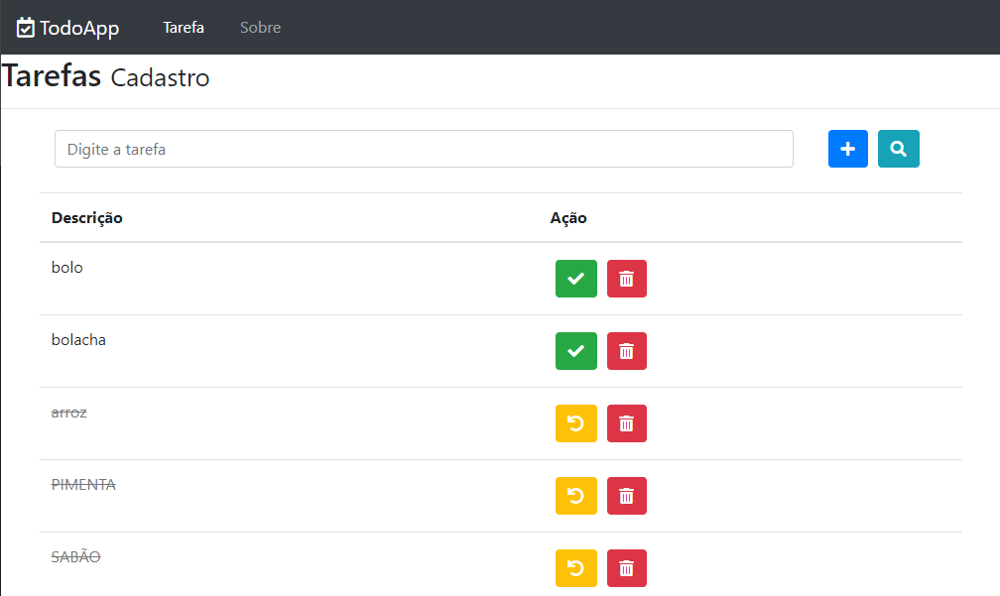
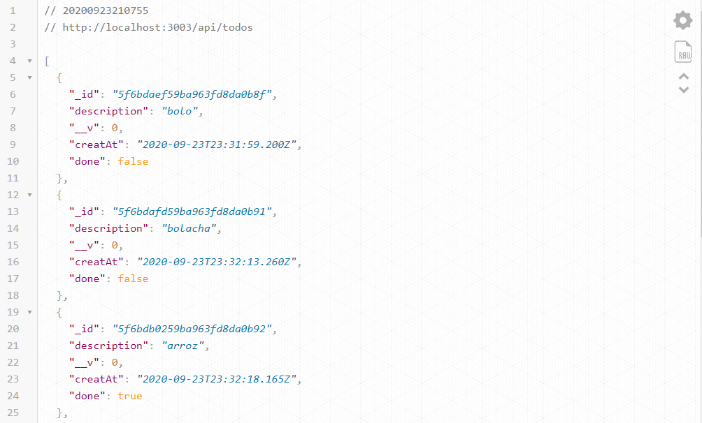

# Lista de Tarefa
## (TO DO)

Esse projeto é mais um treinamento de **REACT JS** onde tem uma ***API***  no `BackEnd` com banco de dados `Mongo DB`
alimenta o `FrontEnd` que consome atravez de uma biblioteca `AXIOS` que faz as requisições `HTTP`. 
Curso Udemy 
>
> ## Interface
> 
> 

> ## API
> 
> 
 

